# BCSDLab-CodeLab-Android
BCSD Lab 19-3 Novice Android Code Lab

## Guide

### Android studio 설치

1. <https://developer.android.com/studio> 에 접속해서 다운로드를 받은 후 설치
2. SDK Platforms 다운로드
- 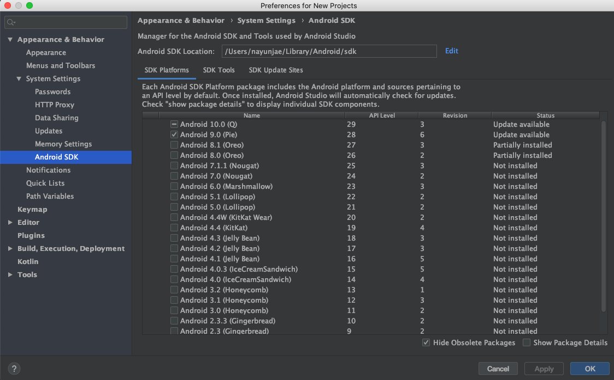
3. SDK Tools 다운로드
- 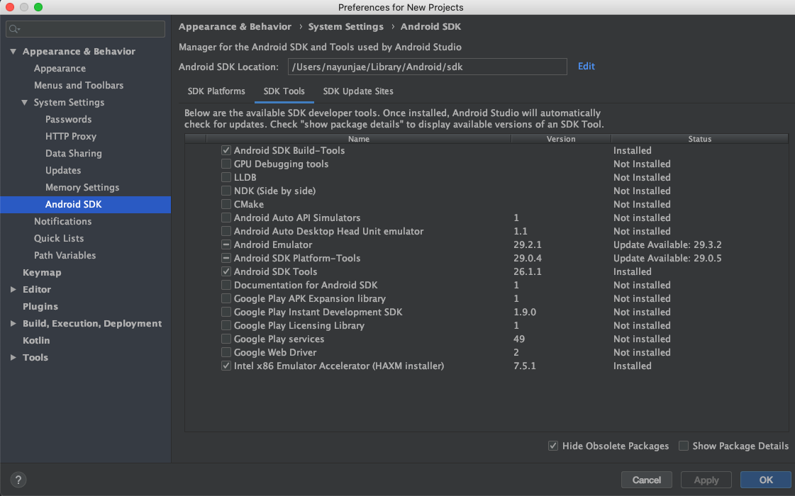

### Get Started

1. Create New Project 선택
2. Empty Activity 선택
- 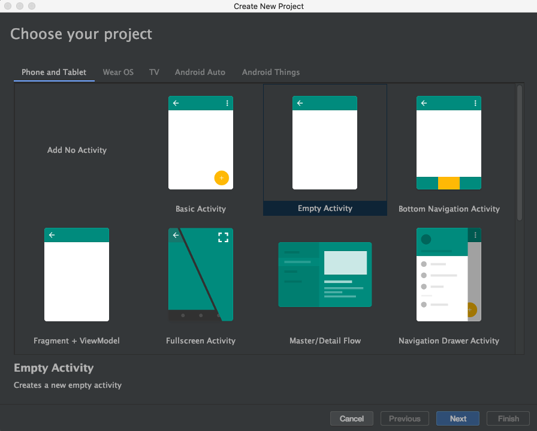
3. 이름 및 minimum api 설정 (경로에 한글이 들어가면 안돼요!)
- 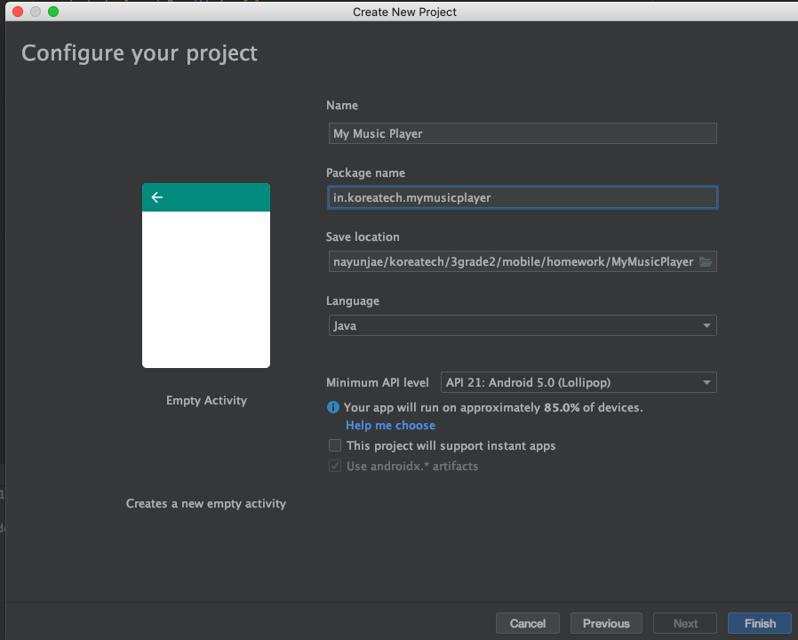
4. Finish
5. 실행 버튼을 눌렀을 때 "hello world" 모바일에 출력되면 성공

### 프로젝트 구조 살펴 보기

1. 프로젝트 구조
- 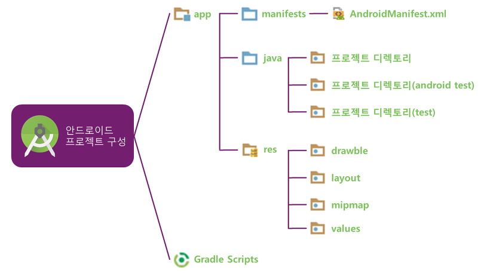

### Android studio manifest에 외부 저장소 쓰기 읽기 권한 추가하기

1. 외부저장소 (공용 디렉토리 Music folder, Download folder 등) 에 접근하기 위해서는 AndroidManifest.xml에 읽기 쓰기 권한을 쓴다고 명시를 해줘야되요 그리고 MashMallow 버전 이상에서는 RuntimePermission도 추가를 해줘야 됩니다.
`<uses-permission android:name="android.permission.WRITE_EXTERNAL_STORAGE" />` 을 추가를 해줍니다. 쓰기 권한을 추가해주면 읽기권한도 자동적으로 추가가 됩니다.
- 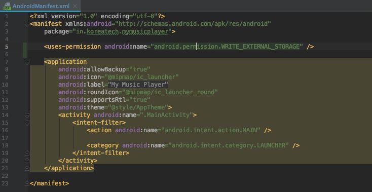

### 레이아웃 꾸미기

1. 여기까지 잘 따라오셨나요? 이제 레이아웃을 꾸며볼꺼에요 지금 꾸미는 layout은 사용자한테 보여주는 화면으로써 여러 view component를 넣어줄수가 있죠 그걸을 포함시킬 부모 layout을 설정해줄건데 저희는 LinearLayout을 사용할겁니다.
LinearLayout은 사용이 간편하고 표시 형태가 직관적이라는 장점을 가졌고 사각형 박스 형태의 디스플레이 화면에 UI 요소들을 일렬로 배치할 수 있어서 안정감있는 화면 구성이 가능하다는 이유 때문에 사용할겁니다.
2. res 패키지에서 layout 패키지에 들어가면 `activity_main.xml` 파일이 있을 겁니다. 선택을 해주세요.
3. 기본적으로 부모 Layout이 `androidx.constraintlayout.widget.ConstraintLayout`로 되어있을꺼에요 이를 `LinearLayout`으로 바꿔주세요 닫히는 태그도 마찬가지입니다.
- 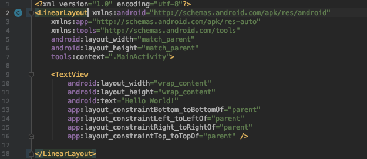
4. Layout을 짜기전에 앞서 한번 어떻게 구현을 할까 고민을 해볼까요? 전체적으로 구상을 하자면 아래와 같은 형태가 나올꺼에요 이를 쪼개서 생각하면 제목이 나오는 부분, 버튼이 있는 부분, 음악 재생 목록이 나오는 부분으로 나눌 수 있겠죠?
- 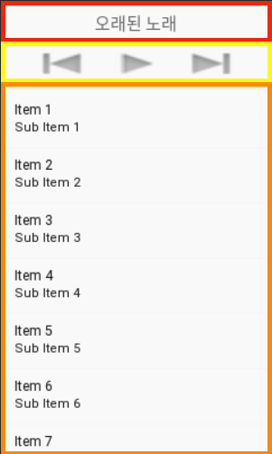
5. 한번 쪼갠것을 코드로 바꿔볼까요? 아래 코드를 참고하면  빨간색 부분이 노래제목을 표시하는곳을 담는 레아웃을 추가 해줬고 노란색 부분이 버튼들을 담아주는 레이아웃이고 주황색부분이 음악재생하는 곳을 출력해주는 ListView를 추가해줬어요. (참고로 부모 Layout에서 `android:orientation = "vertical"` 을 추가해줘야지 수직으로 뷰가 쌓입니다.)
- 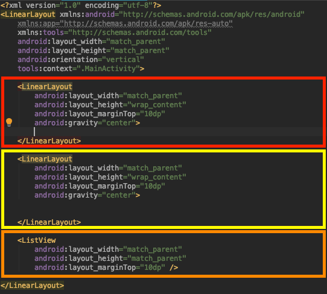
6. 이제 안에다가 view component를 넣어 볼까요 노래제목을 표시해줄 Textview를 추가해주고 버튼들을 추가해줍니다! 코드를 작성해보면 이와 같이 구현할 수 있습니다.
- 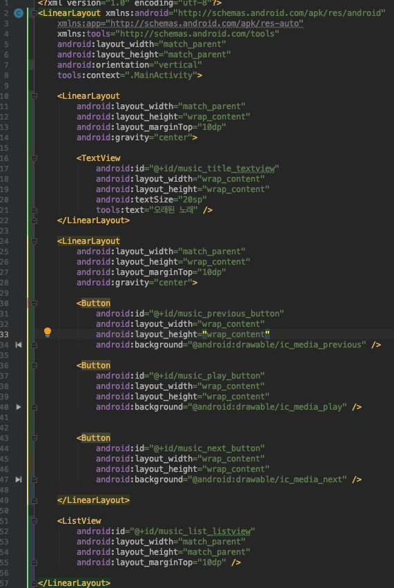
7. `android:id` 는 나중에 자바 코드상으로 연결해서 view를 control 해주기위해 고유한 id값을 넣어줬습니다.
8. 여기까지 하시면 layout 구성은 완료입니다.
9. 실행을 해보면 이와 같이 보일겁니다.
- 

### 기능 구현하기

1. 다시 MainActivty.java 파일로 돌아가볼까요? 코드를 잘 살펴보면 onCreate라는 메소드가 있을겁니다. 그 안에 setContentView라를 메소드를 사용한것도 보이고요. 여기서 onCraete는 액티비티의 생명주기 중 하나로 액티비티가 처음 시작하고 불려지는 메소드입니다. 그리고 view를 초기화 작업을 해줍니다. 보통 여러분께서는 main 함수에서 프로그램이 시작이 되었지만 안드로이드에서는 생명주기로 관리가 되어서 생성 부터 화면이 destroy될때까지 메소드가 하나씩 불려집니다. 생명주기를 나타낸 그림입니다. 더 자세한 정보를 얻고 싶으시면 <https://developer.android.com/guide/components/activities/activity-lifecycle> 에서 확인해주세요.
- 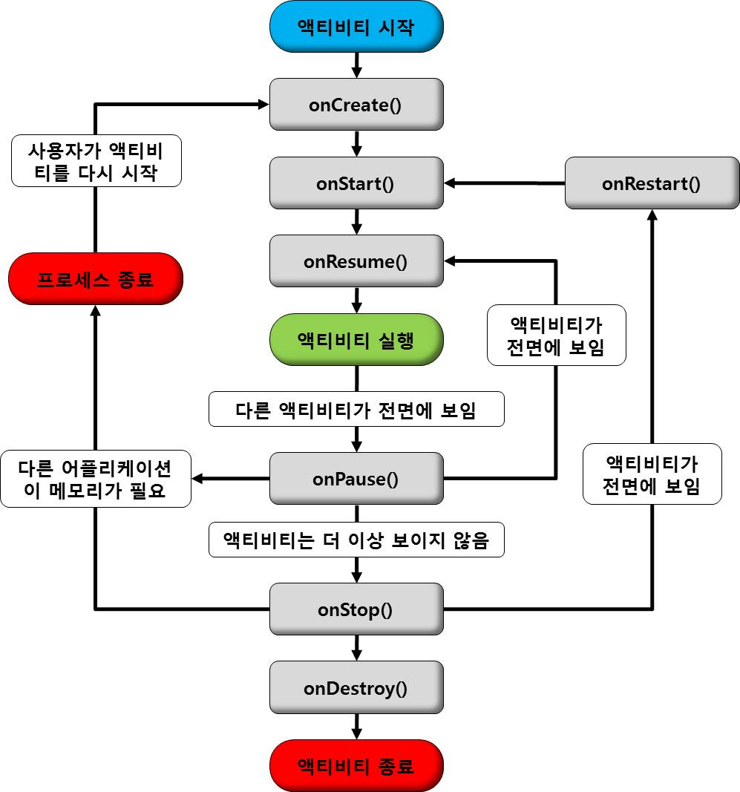
2. 이제 TextView, Button, ListView와 같은 view를 control 해주기위해서 객체에다가 id를 통해서 연결을 해주는 작업을 해줄겁니다. 아까 layout에서 id를 설정했던걸 기억하시죠? 한번 init()함수를 만들어서 해볼까요? 초기화를 하면 이와 같이 나옵니다.
- 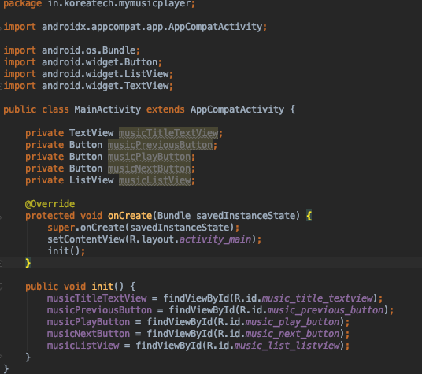
3. 이제 music 폴더에서 음악 리스트를 가져올까요? 가져오기 앞서 위에서 언급했듯이 MashMallow 버전 이상 부터는 RuntimePermission 이라고 해서 사용중에 사용자로 부터 권한을 받아야지 파일 접근이 가능하답니다. 이를 한번 구현해볼까요?
`private boolean isPermitted;` 와 `public final int MY_PERMISSIONS_REQUEST_WRITE_EXTERNAL_STORAGE = 1;` 를 상단에 추가하고 권한을 받아오는 코드를 추가해줍니다. 그리고 추가해준 `requestRuntimePermission` 메소드를 init메소드 끝에서 호출합니다.
- 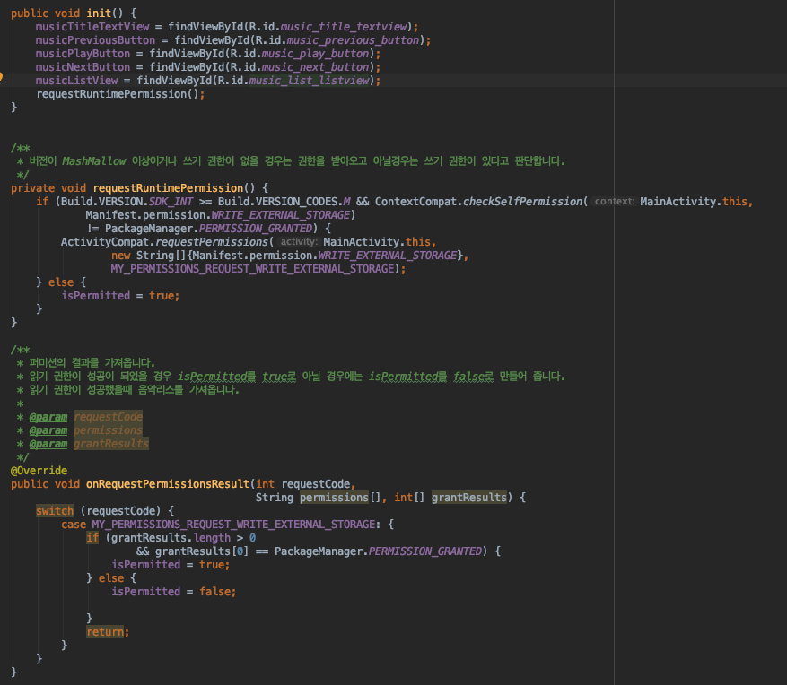
